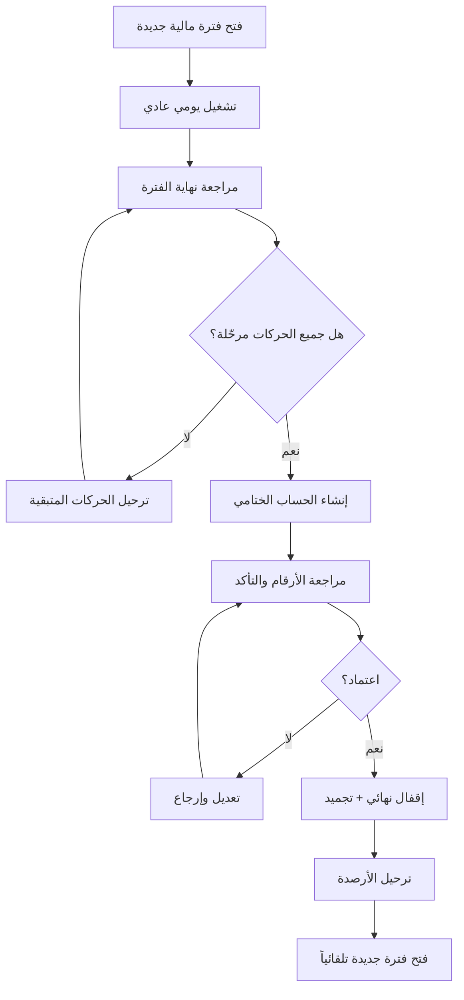

# 📊 الحساب الختامي — تحليل البنية المالية ومقترحات التصميم

---

## أولاً: فهم الوضع الحالي للمنظومة

بعد دراسة جميع الكيانات المالية في المنظومة، تبيّن أن لديك **8 مصادر بيانات مالية** تتكامل مع بعضها:

### مصادر الإيرادات (الأموال الداخلة)
| المصدر | الكيان | الوصف |
|--------|--------|-------|
| 💰 المبيعات النقدية | `SaleHeader` + `CashSession` | المبيعات المحصّلة نقداً عبر الكاشير |
| 🏦 المبيعات المصرفية | `DailyJournal.BankingTotal` + `BankingItem` | المبيعات عبر البطاقات/الشبكة |
| 💵 إيداعات الشركاء | `OwnerDebt` (كمصدر تمويل) | تمويل من شركاء المطعم |

### مصادر المصروفات (الأموال الخارجة)
| المصدر | الكيان | الوصف |
|--------|--------|-------|
| 🧾 مصروفات نثرية يومية | `DailyExpenseItem` | مصروفات الصندوق اليومي |
| 📋 مصروفات عامة | `GeneralExpense` | إيجار، كهرباء، رواتب، إلخ |
| 🚚 مشتريات الموردين | `SupplierInvoice` + `SupplierTransaction` | فواتير ومدفوعات الموردين |

### الأرصدة الحية
| المصدر | الكيان | الوصف |
|--------|--------|-------|
| 🏛️ الحسابات البنكية | `BankAccount.CurrentBalance` | أرصدة جميع الحسابات البنكية |
| 📊 ديون الشركاء | `OwnerDebt` (غير المسددة) | المبالغ المستحقة للشركاء |
| 🏢 ديون الموردين | `Supplier.CurrentBalance` | المبالغ المستحقة للموردين |

---

## ثانياً: المعادلة المالية الأساسية

```
صافي الوضع المالي = (إجمالي الإيرادات + التمويل) - (إجمالي المصروفات + المشتريات)

الأصول السائلة = النقد في الصندوق + أرصدة الحسابات البنكية

صافي الموقف الحقيقي = الأصول السائلة - ديون الموردين - ديون الشركاء
```

---

## ثالثاً: المقترحات

---

### 📋 المقترح الأول: نموذج "اللقطة اليومية" (Daily Snapshot)

> **الفكرة الجوهرية:** في أي لحظة، يمكنك الضغط على زر واحد لترى "صورة مالية" كاملة للمطعم دون إقفال أي شيء.

#### كيف يعمل:
1. **شاشة واحدة** تعرض الوضع المالي اللحظي (Real-time Dashboard)
2. **لا يوجد إقفال** — البيانات تُقرأ مباشرة من الجداول الموجودة
3. يمكنك اختيار **أي تاريخ أو فترة** لعرض الوضع المالي لها
4. إمكانية **حفظ لقطة** كسجل تاريخي للمراجعة لاحقاً

#### هيكل البيانات:
```
FinancialSnapshot (لقطة مالية)
├── SnapshotDate          → تاريخ اللقطة
├── PeriodStart           → بداية الفترة المحسوبة
├── PeriodEnd             → نهاية الفترة المحسوبة
├── TotalSales            → إجمالي المبيعات
├── TotalCashSales        → المبيعات النقدية
├── TotalBankSales        → المبيعات المصرفية
├── TotalDailyExpenses    → مصروفات الصندوق
├── TotalGeneralExpenses  → المصروفات العامة
├── TotalSupplierPurchases → إجمالي المشتريات
├── TotalSupplierPayments → المدفوع للموردين
├── CashOnHand            → النقد في الصندوق
├── TotalBankBalances     → إجمالي أرصدة البنوك
├── TotalSupplierDebts    → ديون الموردين
├── TotalPartnerDebts     → ديون الشركاء
├── GrossProfit           → صافي الربح الإجمالي
├── NetFinancialPosition  → صافي الوضع المالي
├── Notes                 → ملاحظات
└── CreatedBy             → منشئ اللقطة
```

#### المميزات:
- ✅ بسيط جداً في التطبيق
- ✅ لا يؤثر على العمليات اليومية
- ✅ مرن — يمكنك رؤية أي فترة في أي وقت
- ✅ لا يوجد خطر "إقفال خاطئ"

#### العيوب:
- ❌ لا يوجد حماية من التعديل بأثر رجعي
- ❌ أرقام الشهور السابقة قد تتغير إذا عُدّلت بيانات قديمة
- ❌ لا يوجد "قطع حساب" رسمي

---

### 📋 المقترح الثاني: نموذج "الفترات المالية" (Financial Periods) — النموذج المحاسبي الاحترافي

> **الفكرة الجوهرية:** تقسيم الزمن إلى فترات (شهر أو أكثر)، مع إمكانية إقفال كل فترة نهائياً وترحيل الأرصدة للفترة التالية.

#### كيف يعمل:
1. **فتح فترة مالية** جديدة (مثلاً: يونيو 2026)
2. خلال الشهر: جميع العمليات تُسجّل طبيعياً
3. في نهاية الشهر: **إقفال الفترة** يتضمن:
   - ترحيل جميع المبيعات والمصروفات (تصبح `Posted`)
   - حسابات ختامية تلقائية (ربح/خسارة)
   - **تجميد البيانات** — لا يمكن التعديل أو الحذف
   - **ترحيل الأرصدة** إلى الفترة الجديدة
4. **فتح فترة جديدة** تبدأ من حيث انتهت السابقة

#### هيكل البيانات:
```
ClosingAccount (الحساب الختامي)
├── PeriodId              → معرف الفترة المالية
├── PeriodName            → اسم الفترة (مثل: يونيو 2026)
├── StartDate             → بداية الفترة
├── EndDate               → نهاية الفترة
├── Status                → (Open / UnderReview / Closed / Locked)
│
├── === الإيرادات ===
├── OpeningCashBalance    → رصيد النقد الافتتاحي (مُرحّل)
├── TotalSales            → إجمالي المبيعات
├── TotalCashSales        → المبيعات النقدية
├── TotalBankSales        → المبيعات المصرفية
├── TotalPartnerFunding   → تمويل الشركاء
├── OtherIncome           → إيرادات أخرى
│
├── === المصروفات ===
├── TotalDailyExpenses    → مصروفات الصندوق اليومي
├── TotalGeneralExpenses  → المصروفات العامة (مفصلة)
├── TotalRent             → الإيجار
├── TotalSalaries         → الرواتب
├── TotalUtilities        → الخدمات (كهرباء/ماء/إنترنت)
├── TotalSupplierPurchases → فواتير الموردين
├── TotalSupplierPayments → المدفوع للموردين فعلياً
│
├── === الأرصدة عند الإقفال ===
├── ClosingCashBalance    → رصيد النقد الختامي
├── BankBalancesJson      → أرصدة البنوك (مفصلة لكل حساب)
├── SupplierDebtsJson     → ديون الموردين (مفصلة لكل مورد)
├── PartnerDebtsJson      → ديون الشركاء (مفصلة لكل شريك)
│
├── === النتائج ===
├── GrossProfit           → الربح الإجمالي (المبيعات - المشتريات)
├── OperatingExpenses     → المصروفات التشغيلية
├── NetProfit             → صافي الربح/الخسارة
├── NetFinancialPosition  → صافي الوضع المالي الحقيقي
│
├── === الترحيل ===
├── CarriedForwardCash    → النقد المُرحّل للفترة التالية
├── CarriedForwardBanks   → أرصدة البنوك المرحّلة
│
├── ClosedAt              → تاريخ الإقفال
├── ClosedBy              → من نفّذ الإقفال
└── ApprovedBy            → من اعتمد الحساب الختامي
```

#### آلية الإقفال (Closing Workflow):


#### المميزات:
- ✅ حماية كاملة للبيانات التاريخية
- ✅ أرقام مؤكدة ونهائية لا تتغير
- ✅ تتبع الربح/الخسارة شهرياً
- ✅ ترحيل أرصدة محاسبي صحيح
- ✅ يتوافق مع المعايير المحاسبية

#### العيوب:
- ❌ أكثر تعقيداً في التطبيق
- ❌ يتطلب انضباطاً في ترحيل جميع الحركات قبل الإقفال
- ❌ إذا نُسي مصروف أو فاتورة من شهر سابق مُقفل، يصبح التصحيح صعباً
- ❌ يحتاج إلى آلية "فك إقفال" احتياطية (خطيرة)

---

### 📋 المقترح الثالث: النموذج الهجين المرن (Hybrid) — **الأنسب للمطاعم**

> **الفكرة الجوهرية:** الجمع بين مرونة اللقطات وانضباط الفترات، مع "إقفال ناعم" بدلاً من الإقفال الصارم.

#### كيف يعمل:
1. **لوحة مالية حية** تعمل دائماً (مثل المقترح الأول)
2. **فترات مالية مرنة** يمكن فتحها وإقفالها
3. **إقفال ناعم (Soft Close):** عند إقفال الشهر:
   - تُحسب جميع الأرقام وتُحفظ كلقطة ثابتة
   - يرحّل كل ما هو مفتوح تلقائياً
   - **لكن يمكن فك الإقفال** بصلاحية خاصة مع تسجيل في سجل التدقيق
4. **تقرير الوضع المالي اللحظي** متاح في أي وقت
5. **الأرصدة الافتتاحية** تؤخذ تلقائياً من الإقفال السابق

#### واجهة المستخدم المقترحة:

```
┌─────────────────────────────────────────────────────────────┐
│  📊 الحساب الختامي                                          │
│                                                             │
│  [الوضع المالي اللحظي]  [الفترات المالية]  [المقارنات]      │
│                                                             │
│  ═══════════════════════════════════════════════════════     │
│                                                             │
│  📆 الفترة الحالية: يونيو 2026 (مفتوحة)                    │
│  ─────────────────────────────────────────────────────      │
│                                                             │
│  💰 الإيرادات                    📤 المصروفات               │
│  ┌──────────────────┐            ┌──────────────────┐       │
│  │ المبيعات النقدية │ 45,200     │ مصروفات الصندوق  │ 3,500 │
│  │ المبيعات المصرفية│ 12,800     │ المصروفات العامة  │ 8,200 │
│  │ تمويل الشركاء   │  5,000     │ فواتير الموردين   │18,400 │
│  └──────────────────┘            └──────────────────┘       │
│  الإجمالي: 63,000                الإجمالي: 30,100          │
│                                                             │
│  ═══════════════════════════════════════════════════════     │
│                                                             │
│  🏦 الأرصدة الحالية                                        │
│  ┌──────────────────────────────────────────────────┐       │
│  │ 💵 النقد في الصندوق          │       4,200       │       │
│  │ 🏛️ مصرف الجمهورية           │      18,500       │       │
│  │ 🏛️ مصرف التجارة والتنمية    │      12,300       │       │
│  │ 🔴 ديون الموردين (-)         │     -15,600       │       │
│  │ 🔴 ديون الشركاء (-)         │      -5,000       │       │
│  └──────────────────────────────────────────────────┘       │
│                                                             │
│  ══════════════════════════════════════════════════          │
│  📊 صافي الربح: 32,900 د.ل                                 │
│  💎 صافي الوضع المالي الحقيقي: 14,400 د.ل                  │
│  ══════════════════════════════════════════════════          │
│                                                             │
│  [📸 حفظ لقطة مالية]  [🔒 إقفال الشهر الحالي]  [📄 PDF]   │
│                                                             │
└─────────────────────────────────────────────────────────────┘
```

#### المميزات:
- ✅ مرن وعملي — مناسب لطبيعة عمل المطاعم
- ✅ لوحة حية + إقفال رسمي حسب الحاجة
- ✅ إمكانية فك الإقفال مع الحماية (Audit Trail)
- ✅ مقارنات شهرية ورسوم بيانية
- ✅ لا يعطّل العمل اليومي أبداً
- ✅ يبني على البنية الموجودة (PostingSession, FinancialPeriod)

#### العيوب:
- ❌ الإقفال الناعم قد يُساء استخدامه
- ❌ يحتاج تصميماً جيداً للصلاحيات

---

## رابعاً: مقارنة المقترحات

| المعيار | المقترح 1 (لقطات) | المقترح 2 (فترات صارمة) | المقترح 3 (هجين) |
|---------|:------------------:|:------------------------:|:----------------:|
| سهولة التطبيق | ⭐⭐⭐⭐⭐ | ⭐⭐ | ⭐⭐⭐⭐ |
| حماية البيانات | ⭐⭐ | ⭐⭐⭐⭐⭐ | ⭐⭐⭐⭐ |
| مرونة الاستخدام | ⭐⭐⭐⭐⭐ | ⭐⭐ | ⭐⭐⭐⭐⭐ |
| دقة الأرقام | ⭐⭐⭐ | ⭐⭐⭐⭐⭐ | ⭐⭐⭐⭐ |
| مناسب للمطاعم | ⭐⭐⭐ | ⭐⭐⭐ | ⭐⭐⭐⭐⭐ |
| التوافق مع البنية الحالية | ⭐⭐⭐⭐⭐ | ⭐⭐⭐ | ⭐⭐⭐⭐ |
| إمكانية المقارنة الشهرية | ⭐⭐⭐ | ⭐⭐⭐⭐⭐ | ⭐⭐⭐⭐⭐ |
| وقت التطوير المقدر | 3-5 أيام | 10-15 يوم | 7-10 أيام |

---

## خامساً: توصيتي

> [!IMPORTANT]
> أوصي بشدة بـ **المقترح الثالث (الهجين)** لأنه:
> 1. يناسب طبيعة عمل المطاعم التي تحتاج مرونة
> 2. يوفر لوحة مالية حية لمتابعة الوضع في أي لحظة
> 3. يتيح إقفال الفترات رسمياً مع إمكانية التصحيح (بصلاحية)
> 4. يبني على البنية الموجودة — `FinancialPeriod` و `PostingSession` جاهزتان
> 5. يمكن تطويره تدريجياً (البداية باللوحة الحية، ثم إضافة الإقفال)

---

## سادساً: أسئلة تحتاج إجابتك قبل البدء

1. **هل تريد أن يكون الإقفال شهرياً فقط، أم تريد مرونة في تحديد الفترة؟** (مثلاً: أسبوعي، نصف شهري)
2. **هل النقد في الصندوق يُحسب من `CashSession.ActualClosingBalance` أم من مصدر آخر؟**
3. **هل تريد تتبع "رأس المال المستثمر" (أي المبلغ الذي وضعه الشركاء في البداية)؟**
4. **هل تريد رسوم بيانية (Charts) لمقارنة الأشهر؟** (إيرادات vs مصروفات vs ربح)
5. **أي مقترح تميل إليه؟** أم تريد شرحاً أعمق لأحدها؟
