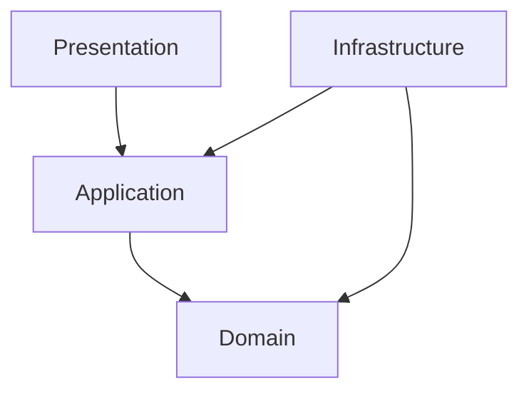

# بنية وهندسة النظام (MeezanPOS Architecture)

يحتوي هذا الملف على التفاصيل التقنية الشاملة، وبنية النظام، والتقنيات المستخدمة، والمعايير البرمجية المتبعة في تطوير **منظومة ميزان للمطاعم (MeezanPOS)**.

---

## 1. التقنيات الأساسية (Technology Stack)

* **لغة البرمجة**: C# (.NET 8.0 Windows)
* **واجهة المستخدم (UI)**: WPF (Windows Presentation Foundation)
* **قاعدة البيانات**: SQLite (عبر EF Core)
* **مكتبة تصميم الواجهات**: `MaterialDesignThemes` و `MaterialDesignColors` (تنسيقات عصرية وثيمات متناسقة)
* **إدارة نمط التصميم**: MVVM باستخدام `CommunityToolkit.Mvvm` (ميزات الأداء العالي ومولدات الكود التلقائية Source Generators مثل `[ObservableProperty]` و `[RelayCommand]`)
* **تصدير التقارير**: `QuestPDF` (مكتبة متطورة تعتمد على الأكواد لبناء مستندات PDF احترافية وسريعة)
* **الرسوم البيانية**: `LiveChartsCore.SkiaSharpView.WPF` (لعرض التحليلات والبيانات المالية في لوحة التحكم)

---

## 2. بنية المجلدات والطبقات (Project Structure & Layers)

تتبع المنظومة هيكلية منظمة تشبه الهندسة النظيفة (Clean/Domain-Driven Architecture) مقسمة كالتالي:

### التفاصيل الهيكلية للمجلدات:

* **`Domain` (نطاق العمل الأساسي)**:
  * `Entities/`: كائنات قاعدة البيانات والبيانات الأساسية مثل:
    * `BankingEntities.cs`: (BankAccount, BankTransaction, CardPaymentReconciliation, OwnerDebt, OwnerDebtSettlement)
    * `CashEntities.cs` و `SupplierEntities.cs` و `GeneralExpenseEntities.cs`
    * `BaseEntity.cs`: الكائن الأب الذي يحتوي على الحقول المشتركة (Id, CreatedAt, UpdatedAt, IsDeleted).
  * `Enums/`: التعدادات الهامة للنظام (مثل `BankTransactionType` و `BankAccountType`).
  * `Interfaces/`: عقود الخدمات والواجهات الخاصة بالنطاق.

* **`Application` (منطق الأعمال والخدمات)**:
  * `Interfaces/`: واجهات الخدمات مثل `IPostingService`.
  * `Services/`: منطق العمل الفعلي والخدمات (مثل `BankService.cs`, `LedgerService.cs`, `PostingService.cs`, `WagesService.cs`).
  * `ViewModels/`: النماذج البرمجية للواجهات (مثل `BankingServicesViewModel.cs` و `SalesViewModel.cs` و `DailyJournalViewModel.cs`).
  * `Services/Reports/`: تقارير الـ PDF المبنية باستخدام QuestPDF (مثل `BankStatementPdfReport.cs`, `DailyJournalPdfReport.cs`).

* **`Infrastructure` (البنية التحتية والوصول للبيانات)**:
  * `Data/`: يحتوي على سياق قاعدة البيانات `AppDbContext.cs` وإعدادات SQLite ومسار قاعدة البيانات الافتراضي الموحد في LocalApplicationData: `%LocalAppData%\MeezanPOS\Meezan.db`.
  * `Repositories/`: مستودعات البيانات لإدارة الاستعلامات.

* **`Presentation` (طبقة العرض والواجهات)**:
  * `Views/`: ملفات XAML مع الكود الخلفي (Code-Behind) الخاص بها (مثل `BankingServicesView.xaml` و `BankStatementReportWindow.xaml`).
  * `Converters/`: محولات البيانات لربط الواجهات بالمنطق البرمجي (مثل `TransactionTypeToNameConverter.cs` لتعريب أنواع العمليات البنكية و `BalanceToColorConverter.cs`).

---

## 3. معايير قاعدة البيانات وقواعدها

* **SQLite DB**: يتم توحيد مسار قاعدة البيانات باستخدام `GetDatabasePath()` في المجلد `%LocalAppData%\MeezanPOS\` لمنع إنشاء قواعد بيانات متعددة في مجلدات التطبيق أو مجلدات البناء المؤقتة.
* **الحذف الناعم (Soft Delete)**: يتم تطبيق فلتر استعلام عالمي (Global Query Filter) في الـ `DbContext` لجميع الكائنات التي ترث من `BaseEntity` لاستثناء العناصر المحذوفة برمجياً (`IsDeleted == false`).
* **تعطيل الحذف المتتالي (Disable Cascade Delete)**: تم تكوين العلاقات في `OnModelCreating` لتكون `DeleteBehavior.Restrict` لحماية سلامة البيانات المالية والقيود البنكية.
* **حقول التدقيق (Audit Fields)**:
  * `CreatedAt`: تاريخ الإنشاء التلقائي.
  * `UpdatedAt`: تاريخ آخر تحديث للكائن.
  * `IsDeleted`: حالة الحذف البرمجي.

---

## 4. معايير الترميز وأسلوب التطوير (Coding Standards)

1. **الالتزام بالنمط MVVM**:
   * الفصل التام بين منطق الواجهات (XAML) ومنطق العمل (ViewModel).
   * الاستفادة القصوى من `CommunityToolkit.Mvvm` لتسهيل الإشعارات والأوامر عبر السمات `[ObservableProperty]` و `[RelayCommand]`.
2. **محولات البيانات (IValueConverters)**:
   * أي ترجمة أو تنسيق مرئي للبيانات في الـ `DataGrid` (مثل تعريب أنواع العمليات أو تلوين الأرصدة) يجب أن تتم في طبقة العرض باستخدام الـ `Converters` للحفاظ على نظافة الـ ViewModel.
3. **أمان العمليات المالية**:
   * إعادة حساب الرصيد الجاري (`CurrentBalance`) في الحساب البنكي عند أي إيداع أو سحب أو تعديل بشكل متسق ودقيق لمنع حدوث فروقات.
   * استخدام العمليات التجميعية اليومية (Daily Aggregation) لعرض المعاملات المتكررة (مثل مبيعات الكروت اليومية) كبند واحد مجمع لتسهيل قراءته في كشف الحساب.
4. **النوافذ المنبثقة للتقارير**:
   * لعرض جداول بيانات ضخمة أو كشوف حسابات تفصيلية، يتم استخدام نوافذ منبثقة مخصصة كبيرة الحجم (مثل `BankStatementReportWindow.xaml`) تحتوي على ملخصات واضحة وأزرار إجراءات مخصصة بدلاً من حشر الجداول في تبويبات ضيقة داخل الصفحة الرئيسية.
